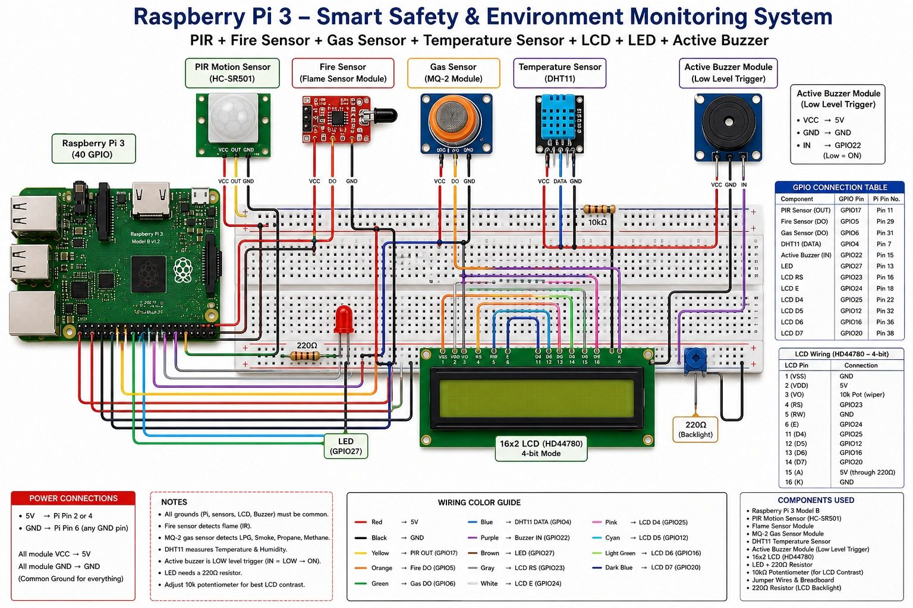
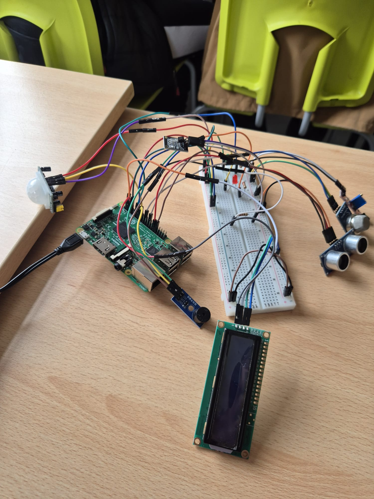
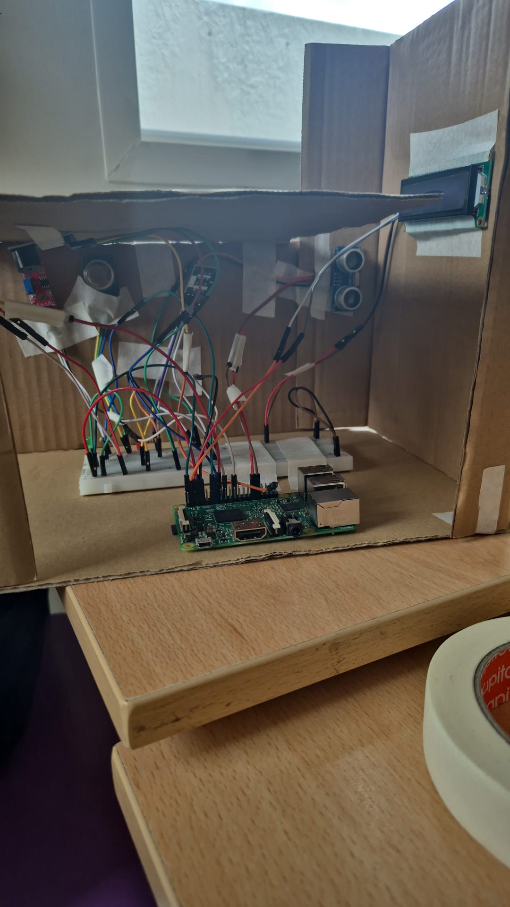
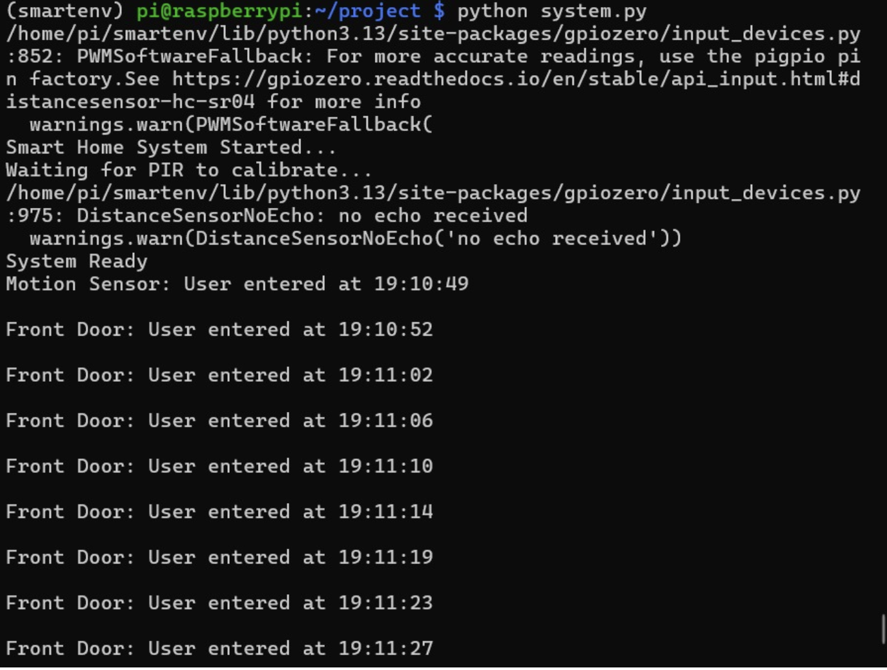

# Raspberry Pi 3 Smart Home Monitoring and Control System

A small scale Smart Home Monitoring and Control System built with a Raspberry Pi 3, combining environmental sensors, safety alerts, and a live LCD display inside a miniature cardboard house model. Built as a college group project for the Group Project module (BSCO GP) at Griffith College Dublin.

## Team

- Han Lee
- Mohamed Fadel Bucharaya
- Tahseen Ahmad

## Overview

The system continuously monitors temperature, motion, fire, and gas levels, displaying live readings on a 16x2 LCD and triggering an LED and buzzer alarm when unsafe conditions are detected. An ultrasonic sensor at the front door logs entry events with timestamps.

## Features

- Real time temperature and humidity monitoring (DHT11)
- Fire detection with automatic alarm
- Gas leak detection with automatic alarm
- PIR motion activated entry detection
- Ultrasonic front door entry logging with timestamps
- Live status updates on a 16x2 I2C LCD
- LED and active buzzer alerts for hazard conditions

## Hardware Components

- Raspberry Pi 3
- PIR Motion Sensor (HC SR501)
- Flame Sensor Module (KY 026)
- MQ 2 Gas Sensor Module
- DHT11 Temperature and Humidity Sensor
- HC SR04 Ultrasonic Sensor (Front Door)
- 16x2 LCD Display (HD44780, I2C via PCF8574)
- Active Buzzer Module
- Entry and Alarm LEDs
- Breadboard, jumper wires, resistors

## Software

- Python 3
- gpiozero
- adafruit_dht
- RPLCD

## Wiring Diagram

<p align="center">
  
</p>

## Build Photos

<p align="center">
  
  
</p>

<p align="center">
  
</p>

## Repository Structure

```text
.
├── Images
│   ├── breadboard-prototype.jpeg
│   ├── cardboard-house-build.jpeg
│   ├── system-output.png
│   └── wiring-diagram.jpeg
├── README.md
├── SmartHome.py
└── ultrasound.py
```

2 directories, 7 files
## How It Works

Sensor data is continuously read by the Raspberry Pi. If temperature exceeds a safe threshold, fire is detected, or gas levels are abnormal, the system activates the buzzer and LED alarm while displaying a warning on the LCD. Motion at the front door (via PIR and ultrasonic sensor) is logged with a timestamp and shown on the LCD as an entry event.

## License

This project was developed as part of an academic group project at Griffith College Dublin and is shared for educational and portfolio purposes. Feel free to reference or learn from the code, but please credit the original authors if reused.







